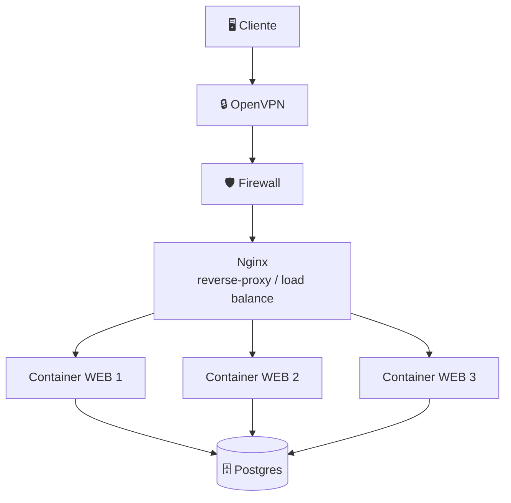

# projeto-redes-computadores

## 💡 Sobre o projeto
Este projeto tem como objetivo implementar uma infraestrutura de rede, utilizando instâncias da AWS para disponibilizar uma aplicação de maneira segura e escalável. A aplicação se trata de um serviço web simples que realiza operações de CRUD em um banco de dados.

## Diagrama



### 🧰 Tecnologias utilizadas
- AWS (Amazon Web Services)
- Ubuntu Server
- Docker
- Docker Compose
- Git
- Nginx
- PostgreSQL

## 🔍 Replicando o ambiente
Para esse projeto vamos utilizar uma instância `t2.micro` da AWS com Ubuntu Server como sistema operacional. Para facilitar o acesso a essa instância utilizaremos o arquivo de chave `.pem` ao invés de `.ppk`, que pode ser utilizado diretamente em qualquer terminal.

### 💻 Acessando o terminal da instância
Utilizando o powershell, execute o comando, substituindo `<chave.pem>` pelo arquivo da sua chave e `<ip_publico>` pelo ipv4 público da sua instância.

`ssh -i <chave.pem> ubuntu@<ip_publico>`

Se for sua primeira vez acessando, o powershell talvez possa pedir que você confirme o acesso. Basta digitar `yes` e pressionar Enter.

### 🐳 Instalando o docker
Agora que acessamos o terminal da nossa instância vamos instalar o docker

```bash
# Atualize os pacotes da instância
sudo apt update
```

```bash
# Baixe o script de instalação do Docker
curl -fsSL https://get.docker.com -o get-docker.sh

# Execute o script
sudo sh ./get-docker.sh --dry-run
```

Para verificar se o Docker foi instalado corretamente execute `docker -v`

### 🚀 Executando o projeto
Execute o comando para clonar o projeto
```bash
# Caso a instância não possua o git, execute sudo apt install git

git clone https://github.com/BrunoVieira003/projeto-redes-computadores.git
```

Após isso execute os comandos:
```bash
cd /projeto-redes-computadores

docker compose up -d
```

Para acessar a aplicação, acesse o navegador e digite `http://<ip_publico>:3000` e de Enter. Observe que a instância alternará a cada acesso devido ao uso do nginx

**OBS: É importante que, nas regras de entrada da instância, em grupos de segurança, a porta 3000 esteja liberada**
